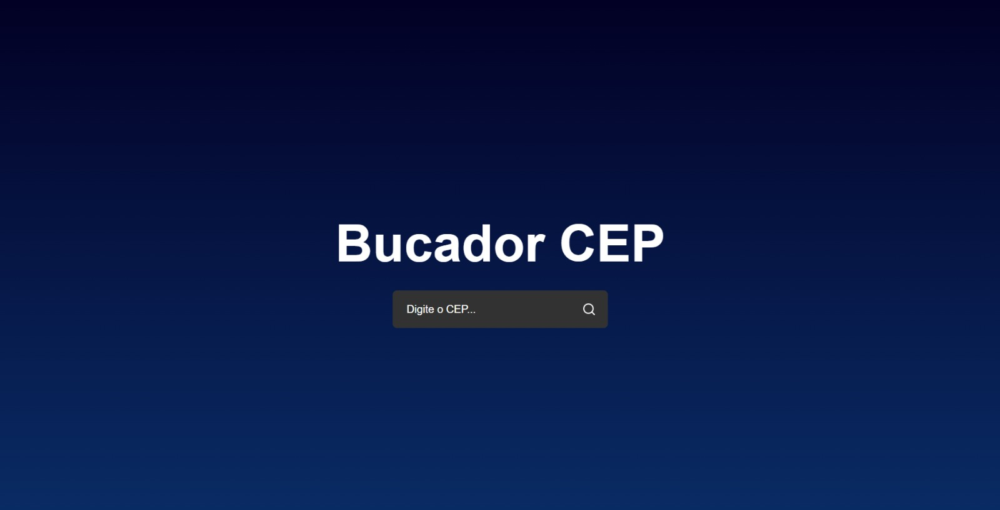
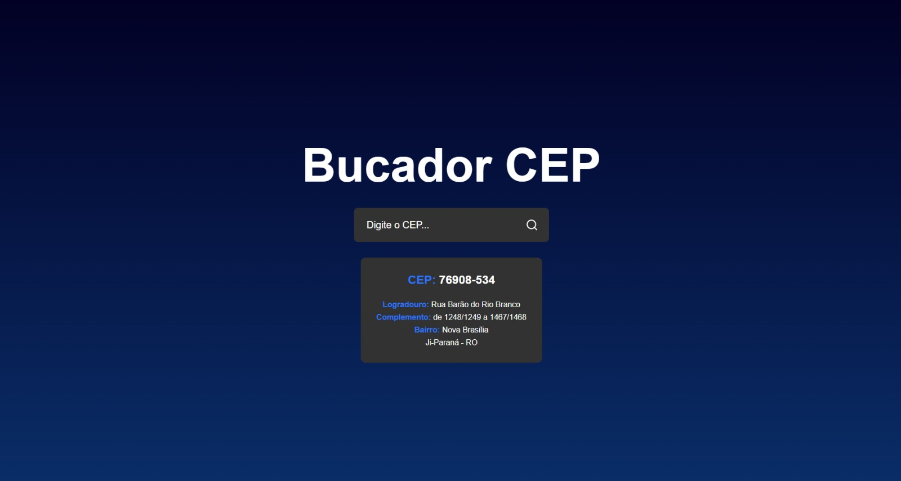

<h1 align="center"> Bucador de CEP </h1>

  
  

## 🚀 Tecnologias

- React.Js
- JavaScript
- CSS
- Git e Github

## 💻 Projeto

Neste projeto eu utilizo os conceitos de funções assincronas, useState, renderização condicional e o uso de API utilizando o axios. A criação deste projeto foi utilizando o Vite. Esse foi o primeiro projeto que construi com React. 

